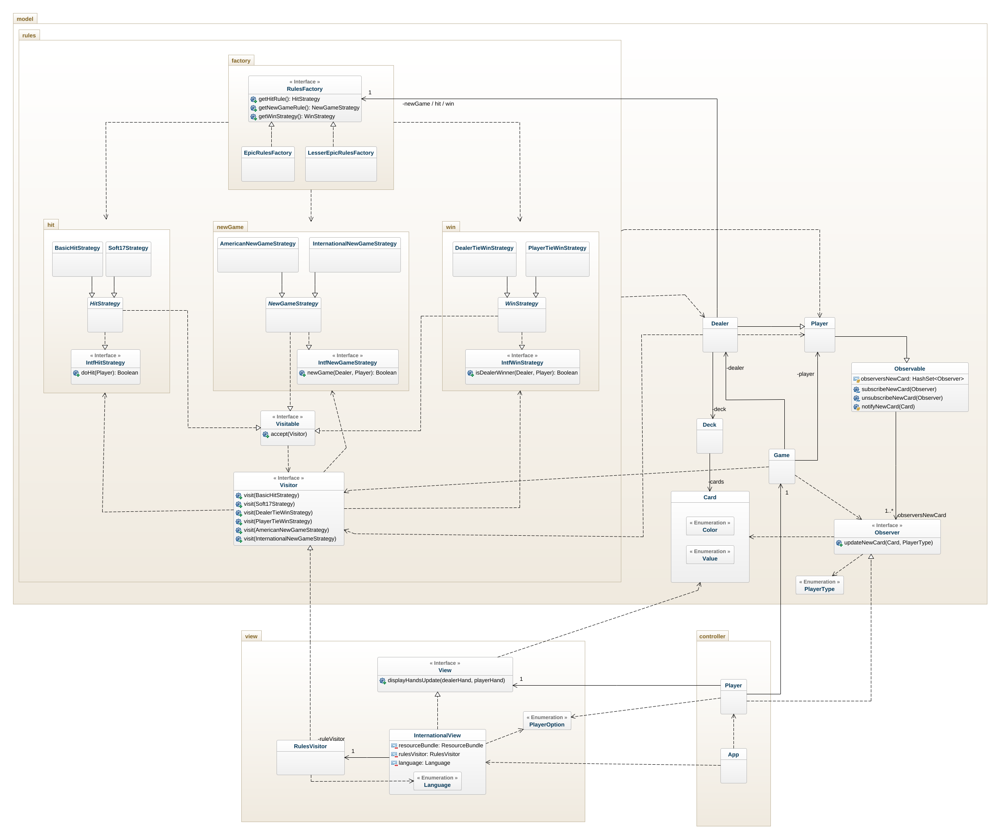

# BlackJack OO-Design
This document describes the current design. Note that some dependencies have been left out for readability reasons. For example there are a lot of dependencies to the Card class.

## Class Diagram
The application uses the model-view-controller (MVC) architectural pattern. The view is passive and gets called from the controller. 

_Note: that there are dependencies in the implementation that are not shown in the diagram for readability purposes, e.g. there are many dependencies to the Card class.
The **"res package"** is not displayed in the view package since the **ResourceBundle** is a java.util, but both **InternationalView** and **RulesVisitor** are associated to the **BundleEn** and **BundleSv** classes in said package._
